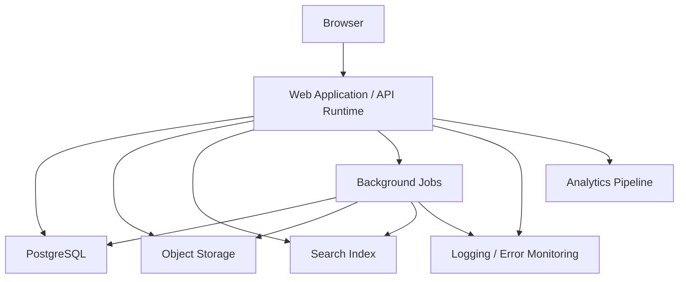

# Industrial Learn Deployment Architecture

## Source IDs

- IL-AGENTS-001: `AGENTS.md`
- IL-PRD-001: `docs/product/product-requirements.md`
- IL-MVP-001: `docs/product/mvp-scope.md`

## Deployment Goals

The first release should be simple enough for a small team and strong enough to support student learning, lecturer visibility, reviewed content, tested calculations, and controlled access to data. Source: IL-MVP-001.

## Environments

Use three environments:

- Development: local and shared development testing.
- Staging: production-like validation before release.
- Production: student, lecturer, author, and reviewer use.

Production releases must not be made directly from a production branch commit. Source: IL-AGENTS-001.

## Runtime Components

The deployment consists of:

- Web application runtime.
- API/application server runtime.
- PostgreSQL database.
- Object storage.
- Background worker runtime.
- Search index.
- Logging and error monitoring service.
- Analytics event processing path.
- Secrets and environment configuration.

For a small first-release team, the web and API runtime may be deployed together if module boundaries remain clear in code and documentation.

## Network Shape

## Web And API Runtime

Responsibilities:

- Serve authenticated web application routes.
- Serve API endpoints.
- Enforce server-side authorisation.
- Coordinate feature modules.
- Call database access layer.
- Issue authorised file access.
- Emit logs and analytics events.

Runtime must not expose service credentials to browser code. Source: IL-AGENTS-001.

## PostgreSQL Deployment

PostgreSQL stores operational data including users, cohorts, assignments, content metadata, progress, assessments, projects, review records, source reference metadata, file metadata, audit records, and analytics summaries.

Deployment requirements:

- Version-controlled migrations.
- Backups before production launch.
- Restore testing before production launch.
- Environment-specific credentials.
- Restricted network access.

## Object Storage Deployment

Object storage holds binary files and larger assets.

Deployment requirements:

- Separate buckets or prefixes for public assets and private files.
- Short-lived access for private uploads and downloads.
- Metadata stored in PostgreSQL.
- Lifecycle policy defined before production launch.

## Background Workers

Background workers handle:

- Search indexing.
- File processing.
- Analytics aggregation.
- Notification preparation.
- Review workflow reminders if introduced.

Background workers must use least-privilege credentials and must write auditable records for sensitive operations.

## Search Deployment

Search can begin with PostgreSQL-backed search for the MVP if content volume is small. A dedicated search service can be introduced when content volume, ranking needs, or future AI mentor retrieval needs justify it.

Student search must filter by approval and access policy. Author and reviewer search may include draft content only when authorised.

## Monitoring And Logging

Production deployment should capture:

- Application errors.
- API latency and failures.
- Background job failures.
- Authentication and authorisation failures.
- Database migration failures.
- Search indexing failures.
- File upload and download failures.
- Calculation and simulation runtime errors.

Logs must avoid secrets and unnecessary student personal data. Source: IL-AGENTS-001.

## Release Flow

1. Work on a non-production branch.
2. Run type checking.
3. Run linting.
4. Run relevant automated tests.
5. Apply migrations in staging.
6. Verify content review and access-control flows in staging.
7. Deploy to production from an approved release process.
8. Monitor errors, logs, and key product health metrics.

## MVP Deployment Recommendation

For the first release, use a managed hosting approach where possible:

- Managed PostgreSQL.
- Managed object storage.
- Managed application hosting.
- Managed logging and error monitoring.

This keeps operational overhead low while the team proves the product model. Source: IL-MVP-001.
