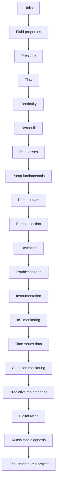

# Smart Pump Systems Masterclass Pathway

## Purpose

This document plans the first complete Industrial Learn masterclass pathway: Smart Pump Systems. It connects Core Engineering foundations to Future Engineering practice without bulk-generating all lesson content.

## Source IDs

- IL-AGENTS-001: `AGENTS.md`
- IL-CURR-001: `docs/curriculum/curriculum-architecture.md`
- IL-ARCH-006: `docs/architecture/adr/0006-simulation-boundary.md`
- IL-ARCH-007: `docs/architecture/adr/0007-review-gated-content-approval.md`
- SRC-SMART-PUMP-PLACEHOLDER-001: Smart pump systems source record to be approved

## 1. Curriculum Map

The pathway is a masterclass for students who have completed introductory mechanics, fluid mechanics, electrical measurement, and programming foundations. It is planned as a staged bridge from Core Engineering to Future Engineering.

| Stage | School             | Unit                   | Lesson status            | Purpose                                                                             |
| ----- | ------------------ | ---------------------- | ------------------------ | ----------------------------------------------------------------------------------- |
| 1     | Core Engineering   | Units                  | First lesson implemented | Establish SI measurement language for pump systems.                                 |
| 2     | Core Engineering   | Fluid properties       | Planned                  | Connect density, viscosity, and temperature to pump-system interpretation.          |
| 3     | Core Engineering   | Pressure               | Planned                  | Interpret pressure measurements and pressure difference in pump circuits.           |
| 4     | Core Engineering   | Flow                   | Planned                  | Interpret volumetric flow rate in pipe and pump contexts.                           |
| 5     | Core Engineering   | Continuity             | Planned                  | Connect area, velocity, and flow conservation in incompressible-flow assumptions.   |
| 6     | Core Engineering   | Bernoulli              | Planned                  | Introduce energy terms, assumptions, and limitations for pump-system reasoning.     |
| 7     | Core Engineering   | Pipe losses            | Planned                  | Connect restrictions, fittings, and pipe loss symptoms.                             |
| 8     | Core Engineering   | Pump fundamentals      | Planned                  | Identify pump components and normal operating boundaries.                           |
| 9     | Core Engineering   | Pump curves            | Planned                  | Interpret pump curve and system curve interactions.                                 |
| 10    | Core Engineering   | Pump selection         | Planned                  | Select a pump from stated duty requirements without inventing manufacturer data.    |
| 11    | Core Engineering   | Cavitation             | Planned                  | Identify cavitation symptoms, risk factors, and safe investigation boundaries.      |
| 12    | Core Engineering   | Troubleshooting        | Planned                  | Diagnose basic low-flow, high-pressure, and abnormal-noise scenarios.               |
| 13    | Future Engineering | Instrumentation        | Planned                  | Connect sensors to measurable pump variables.                                       |
| 14    | Future Engineering | IoT monitoring         | Planned                  | Define safe monitoring architecture and data boundaries.                            |
| 15    | Future Engineering | Time-series data       | Planned                  | Interpret trends, sampling, missing data, and alarms.                               |
| 16    | Future Engineering | Condition monitoring   | Planned                  | Convert measurements into condition indicators with review limits.                  |
| 17    | Future Engineering | Predictive maintenance | Planned                  | Explain maintenance prediction limits and evidence requirements.                    |
| 18    | Future Engineering | Digital twins          | Planned                  | Model a pump-system twin as a reviewed simulation and data interpretation workflow. |
| 19    | Future Engineering | AI-assisted diagnosis  | Planned                  | Use AI-supported diagnosis as a reviewed recommendation, not an automatic decision. |
| 20    | Core + Future      | Final project          | Planned                  | Produce a reviewed smart pump monitoring and diagnosis brief.                       |

## 2. Prerequisite Graph

Required cross-school dependencies:

- Fluid mechanics foundations before smart pump monitoring. Source: IL-CURR-001.
- Electrical circuits foundations before instrumentation and IoT monitoring. Source: IL-CURR-001.
- Programming foundations before time-series data and AI-assisted diagnosis. Source: IL-CURR-001.

## 3. Learning Outcomes

By the end of the pathway, learners should be able to:

1. Use consistent SI units for pump-system measurements. Source: IL-AGENTS-001.
2. Interpret pressure, flow, and fluid-property measurements in stated assumptions. Source: SRC-SMART-PUMP-PLACEHOLDER-001.
3. Explain continuity, Bernoulli, and pipe-loss assumptions before applying results. Source: SRC-SMART-PUMP-PLACEHOLDER-001.
4. Interpret pump curves and system curves without inventing manufacturer data. Source: IL-AGENTS-001.
5. Identify cavitation and basic pump fault symptoms within safe training boundaries. Source: SRC-SMART-PUMP-PLACEHOLDER-001.
6. Select instrumentation for pressure, flow, temperature, vibration, and status signals using approved source evidence. Source: SRC-SMART-PUMP-PLACEHOLDER-001.
7. Read time-series pump data for trends, alarms, and missing-data limitations. Source: SRC-SMART-PUMP-PLACEHOLDER-001.
8. Distinguish condition monitoring evidence from predictive-maintenance claims. Source: SRC-SMART-PUMP-PLACEHOLDER-001.
9. Explain the purpose and limits of a pump-system digital twin. Source: IL-ARCH-006.
10. Use AI-assisted diagnosis only as reviewed decision support. Source: IL-ARCH-007.
11. Produce a final monitoring and diagnostic project brief with source IDs, assumptions, safety limits, and review status. Source: IL-AGENTS-001.

## 4. Knowledge-File Requirements

Each knowledge file must be one focused topic and use the required knowledge-file sections.

| ID                                 | Topic                                   | Required before lesson |
| ---------------------------------- | --------------------------------------- | ---------------------- |
| KF-SMART-PUMP-UNITS-001            | Pump-system units and measurements      | Units                  |
| KF-SMART-PUMP-FLUID-PROPERTIES-001 | Pump-relevant fluid properties          | Fluid properties       |
| KF-SMART-PUMP-PRESSURE-001         | Pump pressure and pressure difference   | Pressure               |
| KF-SMART-PUMP-FLOW-001             | Volumetric flow in pump systems         | Flow                   |
| KF-SMART-PUMP-CONTINUITY-001       | Continuity assumptions for pump systems | Continuity             |
| KF-SMART-PUMP-BERNOULLI-001        | Bernoulli terms and limits              | Bernoulli              |
| KF-SMART-PUMP-PIPE-LOSSES-001      | Pipe losses and restrictions            | Pipe losses            |
| KF-SMART-PUMP-FUNDAMENTALS-001     | Pump components and operation           | Pump fundamentals      |
| KF-SMART-PUMP-CURVES-001           | Pump and system curves                  | Pump curves            |
| KF-SMART-PUMP-SELECTION-001        | Pump selection workflow                 | Pump selection         |
| KF-SMART-PUMP-CAVITATION-001       | Cavitation symptoms and boundaries      | Cavitation             |
| KF-SMART-PUMP-TROUBLESHOOTING-001  | Pump troubleshooting patterns           | Troubleshooting        |
| KF-SMART-PUMP-INSTRUMENTATION-001  | Pump instrumentation                    | Instrumentation        |
| KF-SMART-PUMP-IOT-001              | Industrial IoT monitoring               | IoT monitoring         |
| KF-SMART-PUMP-TIME-SERIES-001      | Pump time-series data                   | Time-series data       |
| KF-SMART-PUMP-CONDITION-001        | Condition monitoring indicators         | Condition monitoring   |
| KF-SMART-PUMP-PREDICTIVE-001       | Predictive maintenance limits           | Predictive maintenance |
| KF-SMART-PUMP-DIGITAL-TWIN-001     | Pump-system digital twins               | Digital twins          |
| KF-SMART-PUMP-AI-DIAGNOSIS-001     | AI-assisted pump diagnosis              | AI-assisted diagnosis  |

## 5. Source Requirements

The pathway may remain draft while source evidence is pending. No lesson may be marked source checked or approved until approved source records and review records exist.

Required source categories:

- SI units and measurement conventions.
- Fluid properties and pump-system hydraulics.
- Pressure, flow, continuity, Bernoulli, and pipe-loss references.
- Pump curves, pump selection, and cavitation references.
- Pump troubleshooting and safety references.
- Industrial instrumentation and signal references.
- IoT monitoring and time-series data references.
- Condition monitoring and predictive maintenance references.
- Digital twin and AI-assisted diagnosis governance references.
- Manufacturer data only when a named manufacturer document exists; otherwise no ratings or curves may be invented.

## 6. Equation Register

Equations must be implemented as pure tested functions before student-facing calculations rely on them.

| Equation ID                            | Topic                        | Implementation status                            |
| -------------------------------------- | ---------------------------- | ------------------------------------------------ |
| EQ-SI-CONVERSION-EXPLICIT-001          | Explicit unit conversion     | Existing in engineering core                     |
| EQ-FLUID-PRESSURE-001                  | Pressure from force and area | Existing in engineering core                     |
| EQ-FLUID-VOLUMETRIC-FLOW-001           | Volumetric flow rate         | Existing in engineering core                     |
| EQ-FLUID-CONTINUITY-INCOMPRESSIBLE-001 | Continuity relation          | Existing in engineering core                     |
| EQ-FLUID-VELOCITY-FLOW-AREA-001        | Velocity from flow and area  | Existing in engineering core                     |
| EQ-FLUID-HYDRAULIC-POWER-001           | Hydraulic power              | Existing in engineering core                     |
| EQ-SMART-PUMP-BERNOULLI-001            | Bernoulli energy relation    | Planned; do not use until implemented and tested |
| EQ-SMART-PUMP-PIPE-LOSS-001            | Pipe-loss model              | Planned; do not use until implemented and tested |
| EQ-SMART-PUMP-NPSH-001                 | NPSH/cavitation check        | Planned; do not use until implemented and tested |
| EQ-SMART-PUMP-EFFICIENCY-001           | Pump efficiency              | Planned; do not use until implemented and tested |

## 7. Simulation Plan

| Simulation ID                    | Purpose                                                       | State coverage required |
| -------------------------------- | ------------------------------------------------------------- | ----------------------- |
| SIM-SMART-PUMP-UNITS-001         | Read pressure, flow, and temperature measurements in SI units | normal, boundary, fault |
| SIM-SMART-PUMP-PRESSURE-FLOW-001 | Explore pressure and flow response to restriction changes     | normal, boundary, fault |
| SIM-SMART-PUMP-CURVE-001         | Compare pump curve and system curve operating point           | normal, boundary, fault |
| SIM-SMART-PUMP-CAVITATION-001    | Identify cavitation-risk symptoms                             | normal, boundary, fault |
| SIM-SMART-PUMP-IOT-MONITOR-001   | Monitor live sensor streams and alarms                        | normal, boundary, fault |
| SIM-SMART-PUMP-DIGITAL-TWIN-001  | Compare measured data to model output                         | normal, boundary, fault |
| SIM-SMART-PUMP-AI-DIAGNOSIS-001  | Use reviewed AI-supported recommendations                     | normal, boundary, fault |

## 8. Assessment Plan

Assessment types:

- Multiple-choice vocabulary checks.
- Numeric engineering calculations with SI-unit validation.
- Component identification on pump schematics.
- Diagram questions for pump curves and monitoring architecture.
- Sequence questions for troubleshooting workflows.
- Simulation tasks for normal, boundary, and fault states.
- Fault-diagnosis tasks for low flow, high pressure, cavitation risk, sensor fault, and data-quality issues.
- Design challenge in the final project.

No answers or scoring explanations may be exposed before submission.

## 9. Fault-Diagnosis Plan

Fault families:

- Incorrect unit interpretation.
- Blocked or restricted line.
- Low suction pressure.
- Cavitation-risk symptoms.
- Closed or partially closed valve.
- Pump operating away from expected duty point.
- Sensor offset or stuck signal.
- Missing time-series data.
- False alarm caused by data-quality issue.
- AI-assisted diagnosis overreach where recommendation lacks evidence.

Fault-diagnosis progression:

1. Recognise abnormal measurement.
2. Check units and instrument state.
3. Compare pressure, flow, and operating state.
4. Use diagnostic measurements.
5. State likely causes and safe next actions.
6. Record evidence and uncertainty.

## 10. Final Project Brief

Title: Smart Pump Monitoring And Diagnosis Brief

Learner output:

- Pump-system description with assumptions and boundaries.
- Instrumentation plan with source IDs.
- Normal operating measurement set.
- Fault-condition table.
- Time-series monitoring plan.
- Diagnostic workflow.
- Digital-twin or simulation boundary statement.
- AI-assisted diagnosis risk statement.
- Safety limits.
- Engineering review checklist.

The project must not include invented manufacturer curves, equipment ratings, standards clauses, or unsupported maintenance claims.

## 11. Engineering-Review Checklist

- All important technical statements include source IDs.
- Source records are approved before source-checked status.
- Equations exist in the engineering-core package and have automated tests.
- Calculations use SI units internally.
- Simulations include normal-state, boundary-state, and fault-state tests.
- Safety warnings exist for real pressurised systems.
- Fault-diagnosis tasks distinguish evidence from speculation.
- Assessment answers include explanations.
- AI-assisted diagnosis content is framed as reviewed decision support.
- No content is marked Approved for student use without a review record.

## 12. Implementation Order

1. Implement first lesson: Smart Pump System Units And Measurements.
2. Add source-approved references for SI units and pump measurement terminology.
3. Add fluid properties knowledge file and lesson shell.
4. Extend engineering-core only for equations not already implemented.
5. Add pressure and flow lessons.
6. Add continuity lesson and simulation.
7. Add Bernoulli and pipe-loss equations only after source review.
8. Add pump fundamentals and pump-curve lessons.
9. Add cavitation and troubleshooting simulations.
10. Add instrumentation and IoT monitoring lessons.
11. Add time-series and condition-monitoring lessons.
12. Add predictive maintenance, digital twin, and AI-assisted diagnosis lessons.
13. Add the final project and review workflow.

## Validation Notes

This plan is a draft planning artifact. Only the first lesson is implemented as structured content during this task. All planned downstream content remains unimplemented until sources, calculations, simulations, tests, and engineering review are added.
