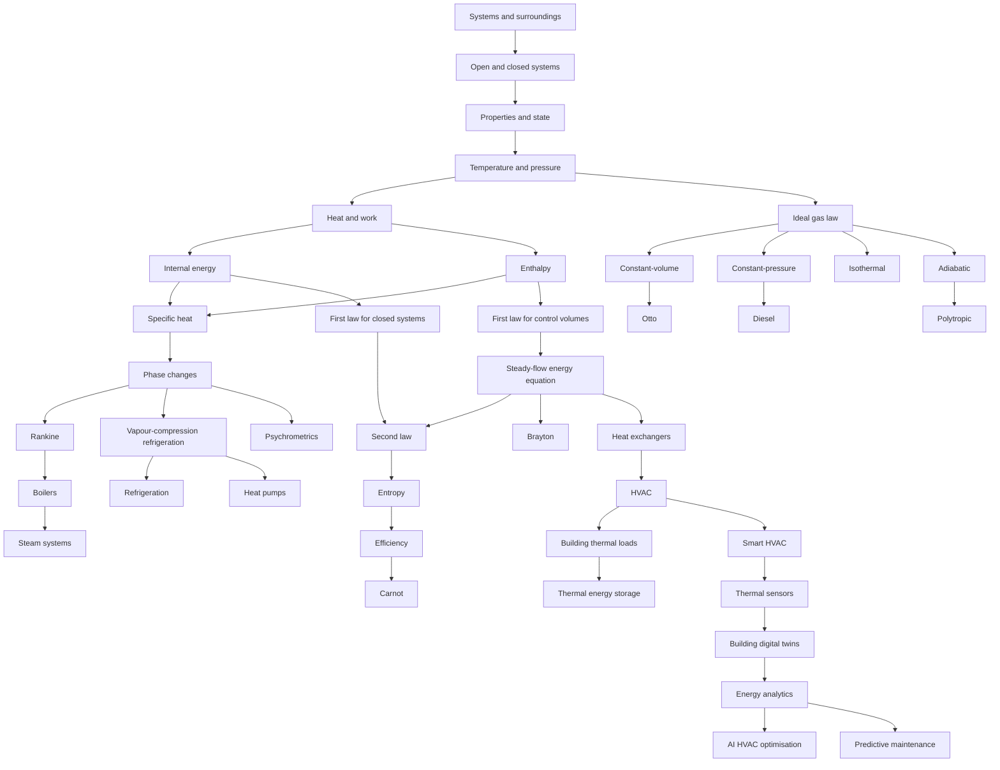

# Thermodynamics Masterclass Pathway

## Purpose

This document plans the Industrial Learn Thermodynamics masterclass from foundational system definitions through energy laws, thermodynamic processes, cycles, thermal applications, and Future Engineering connections. It is a planning artifact only. The first foundation lesson must be implemented only after the plan is approved.

## Source IDs

- IL-AGENTS-001: `AGENTS.md`
- IL-CURR-001: `docs/curriculum/curriculum-architecture.md`
- IL-ARCH-005: `docs/architecture/adr/0005-pure-engineering-calculation-library.md`
- IL-ARCH-006: `docs/architecture/adr/0006-simulation-boundary.md`
- IL-ARCH-007: `docs/architecture/adr/0007-review-gated-content-approval.md`
- SRC-THERMO-PLACEHOLDER-001: Thermodynamics source record to be approved before student-use publication

## Scope Boundary

The pathway may name planned topics and evidence requirements, but it must not invent steam, refrigerant, air, psychrometric, fuel, or material property data. Any property lookup, table, chart, refrigerant state, steam state, or material value must come from an approved source record or a validated property-data service before being used in lessons, simulations, or assessments. Source: IL-AGENTS-001.

## Lesson Sequence

### Foundations

| Order | Lesson ID                           | Lesson                   | Purpose                                                          | Status                                          |
| ----- | ----------------------------------- | ------------------------ | ---------------------------------------------------------------- | ----------------------------------------------- |
| 1     | LES-THERMO-SYSTEMS-SURROUNDINGS-001 | Systems And Surroundings | Define thermal system boundary language.                         | Planned for first implementation after approval |
| 2     | LES-THERMO-OPEN-CLOSED-SYSTEMS-001  | Open And Closed Systems  | Distinguish mass and energy crossing boundaries.                 | Planned                                         |
| 3     | LES-THERMO-PROPERTIES-STATE-001     | Properties And State     | Introduce state, intensive properties, and extensive properties. | Planned                                         |
| 4     | LES-THERMO-TEMPERATURE-PRESSURE-001 | Temperature And Pressure | Interpret temperature and pressure as measured properties.       | Planned                                         |
| 5     | LES-THERMO-HEAT-WORK-001            | Heat And Work            | Distinguish energy transfer by heat and work.                    | Planned                                         |
| 6     | LES-THERMO-INTERNAL-ENERGY-001      | Internal Energy          | Introduce internal energy as a property.                         | Planned                                         |
| 7     | LES-THERMO-ENTHALPY-001             | Enthalpy                 | Introduce enthalpy for flowing systems.                          | Planned                                         |
| 8     | LES-THERMO-SPECIFIC-HEAT-001        | Specific Heat            | Use source-backed specific heat assumptions.                     | Planned                                         |
| 9     | LES-THERMO-PHASE-CHANGES-001        | Phase Changes            | Introduce phase-change language and property-data boundaries.    | Planned                                         |
| 10    | LES-THERMO-IDEAL-GAS-LAW-001        | Ideal Gas Law            | Apply ideal gas assumptions and SI units.                        | Planned                                         |

### Energy Laws

| Order | Lesson ID                                | Lesson                        | Purpose                                                      | Status  |
| ----- | ---------------------------------------- | ----------------------------- | ------------------------------------------------------------ | ------- |
| 11    | LES-THERMO-FIRST-LAW-CLOSED-001          | First Law For Closed Systems  | Apply closed-system energy accounting.                       | Planned |
| 12    | LES-THERMO-FIRST-LAW-CONTROL-VOLUMES-001 | First Law For Control Volumes | Introduce control-volume energy terms.                       | Planned |
| 13    | LES-THERMO-SFEE-001                      | Steady-Flow Energy Equation   | Apply SFEE under stated assumptions.                         | Planned |
| 14    | LES-THERMO-SECOND-LAW-001                | Second Law                    | Introduce directionality and limits.                         | Planned |
| 15    | LES-THERMO-ENTROPY-001                   | Entropy                       | Introduce entropy as reviewed source-backed content.         | Planned |
| 16    | LES-THERMO-EFFICIENCY-001                | Efficiency                    | Distinguish thermal efficiency, COP, and performance claims. | Planned |

### Thermodynamic Processes

| Order | Lesson ID                        | Lesson                    | Purpose                                        | Status  |
| ----- | -------------------------------- | ------------------------- | ---------------------------------------------- | ------- |
| 17    | LES-THERMO-CONSTANT-VOLUME-001   | Constant-Volume Process   | Analyse fixed-volume process assumptions.      | Planned |
| 18    | LES-THERMO-CONSTANT-PRESSURE-001 | Constant-Pressure Process | Analyse constant-pressure process assumptions. | Planned |
| 19    | LES-THERMO-ISOTHERMAL-001        | Isothermal Process        | Analyse constant-temperature idealisations.    | Planned |
| 20    | LES-THERMO-ADIABATIC-001         | Adiabatic Process         | Analyse no-heat-transfer idealisations.        | Planned |
| 21    | LES-THERMO-POLYTROPIC-001        | Polytropic Process        | Introduce polytropic process modelling limits. | Planned |

### Cycles

| Order | Lesson ID              | Lesson                           | Purpose                                                                     | Status  |
| ----- | ---------------------- | -------------------------------- | --------------------------------------------------------------------------- | ------- |
| 22    | LES-THERMO-CARNOT-001  | Carnot Cycle                     | Use Carnot as a limit concept, not a real plant model.                      | Planned |
| 23    | LES-THERMO-OTTO-001    | Otto Cycle                       | Introduce ideal air-standard engine cycle assumptions.                      | Planned |
| 24    | LES-THERMO-DIESEL-001  | Diesel Cycle                     | Introduce ideal Diesel cycle assumptions.                                   | Planned |
| 25    | LES-THERMO-BRAYTON-001 | Brayton Cycle                    | Introduce gas-turbine cycle assumptions.                                    | Planned |
| 26    | LES-THERMO-RANKINE-001 | Rankine Cycle                    | Introduce steam-cycle concepts with approved property data only.            | Planned |
| 27    | LES-THERMO-VCR-001     | Vapour-Compression Refrigeration | Introduce refrigeration cycle concepts with approved refrigerant data only. | Planned |

### Thermal Applications

| Order | Lesson ID                      | Lesson                 | Purpose                                                              | Status  |
| ----- | ------------------------------ | ---------------------- | -------------------------------------------------------------------- | ------- |
| 28    | LES-THERMO-HEAT-EXCHANGERS-001 | Heat Exchangers        | Compare energy balance and heat-transfer assumptions.                | Planned |
| 29    | LES-THERMO-REFRIGERATION-001   | Refrigeration          | Interpret refrigeration performance using approved refrigerant data. | Planned |
| 30    | LES-THERMO-HEAT-PUMPS-001      | Heat Pumps             | Interpret COP and boundary assumptions.                              | Planned |
| 31    | LES-THERMO-PSYCHROMETRICS-001  | Psychrometrics         | Use approved moist-air property data only.                           | Planned |
| 32    | LES-THERMO-HVAC-001            | HVAC                   | Connect thermal loads, comfort, and system boundaries.               | Planned |
| 33    | LES-THERMO-BOILERS-001         | Boilers                | Introduce boiler energy boundaries and safety review requirements.   | Planned |
| 34    | LES-THERMO-STEAM-SYSTEMS-001   | Steam Systems          | Interpret steam-system measurements with approved steam data only.   | Planned |
| 35    | LES-THERMO-BUILDING-LOADS-001  | Building Thermal Loads | Estimate loads only after source-backed assumptions are approved.    | Planned |

### Future Engineering Connections

| Order | Lesson ID                             | Lesson                 | Purpose                                                  | Status  |
| ----- | ------------------------------------- | ---------------------- | -------------------------------------------------------- | ------- |
| 36    | LES-THERMO-SMART-HVAC-001             | Smart HVAC             | Connect thermal foundations to monitored HVAC systems.   | Planned |
| 37    | LES-THERMO-THERMAL-SENSORS-001        | Thermal Sensors        | Interpret sensor signals and uncertainty.                | Planned |
| 38    | LES-THERMO-BUILDING-DIGITAL-TWINS-001 | Building Digital Twins | Map model boundaries to building data.                   | Planned |
| 39    | LES-THERMO-ENERGY-ANALYTICS-001       | Energy Analytics       | Interpret energy trends without unsupported conclusions. | Planned |
| 40    | LES-THERMO-AI-HVAC-OPTIMISATION-001   | AI HVAC Optimisation   | Use AI recommendations as reviewed decision support.     | Planned |
| 41    | LES-THERMO-PREDICTIVE-MAINTENANCE-001 | Predictive Maintenance | Separate evidence from prediction claims.                | Planned |
| 42    | LES-THERMO-THERMAL-STORAGE-001        | Thermal Energy Storage | Introduce storage concepts and property-data boundaries. | Planned |

## Prerequisite Graph

Cross-school prerequisites:

- `mod-core-thermodynamics-001` before `mod-future-ai-hvac-optimisation-001`. Source: IL-CURR-001.
- Programming foundations before energy analytics and AI HVAC optimisation. Source: IL-CURR-001.
- Electrical circuits foundations before thermal sensors and connected HVAC monitoring. Source: IL-CURR-001.

## Source Requirements

Required source categories:

- Thermodynamics terminology and system-boundary definitions.
- SI units for temperature, pressure, energy, power, and specific quantities.
- Ideal gas assumptions and gas constant usage.
- Closed-system and control-volume first-law references.
- Second-law, entropy, and efficiency references.
- Process and cycle references.
- Heat exchanger, HVAC, refrigeration, heat pump, boiler, steam, and building-load references.
- Sensor, monitoring, analytics, digital twin, AI optimisation, predictive maintenance, and thermal energy storage references.

Hard source boundary:

- Steam tables, refrigerant tables, psychrometric data, air-property data, fuel properties, and material thermal properties must come from approved source records or an approved property-data service.
- No lesson, assessment, simulation, or project may invent property values, manufacturer data, equipment ratings, refrigerant data, steam states, or standards clauses.

## Property-Data Strategy

1. Store property data as source-governed datasets, not hand-entered lesson prose.
2. Give every property dataset a source ID, version, unit system, valid range, interpolation policy, limitations, and review record.
3. Use SI units internally for all calculations.
4. Keep property lookup separate from UI components and lesson content.
5. Treat unavailable or out-of-range property data as an explicit invalid state.
6. Require tests for normal, boundary, and invalid/out-of-range property lookups.
7. Never publish worked examples that depend on property data until the dataset and equations are reviewed.

Initial property-data needs:

- Ideal gas constant and ideal gas assumptions.
- Constant specific heat examples with approved values.
- Steam saturation and superheated-region data for Rankine and steam-system lessons.
- Refrigerant property data for vapour-compression refrigeration lessons.
- Moist-air/psychrometric data for HVAC and psychrometrics lessons.
- Building material thermal data for thermal-load lessons.

## Simulation Roadmap

| Simulation ID                   | Topic                    | Purpose                                                                                        | Required test states    |
| ------------------------------- | ------------------------ | ---------------------------------------------------------------------------------------------- | ----------------------- |
| SIM-THERMO-SYSTEM-BOUNDARY-001  | Systems and surroundings | Classify energy and mass crossings.                                                            | normal, boundary, fault |
| SIM-THERMO-PROPERTY-STATE-001   | Properties and state     | Change state inputs and inspect validity.                                                      | normal, boundary, fault |
| SIM-THERMO-IDEAL-GAS-001        | Ideal gas law            | Solve one missing variable with SI validation.                                                 | normal, boundary, fault |
| SIM-THERMO-FIRST-LAW-CLOSED-001 | Closed-system first law  | Track heat, work, and internal-energy change.                                                  | normal, boundary, fault |
| SIM-THERMO-CONTROL-VOLUME-001   | Control volume           | Track steady-flow energy terms.                                                                | normal, boundary, fault |
| SIM-THERMO-PROCESSES-001        | Processes                | Compare constant-volume, constant-pressure, isothermal, adiabatic, and polytropic assumptions. | normal, boundary, fault |
| SIM-THERMO-CYCLES-001           | Cycles                   | Compare idealised cycle stages and efficiency limits.                                          | normal, boundary, fault |
| SIM-THERMO-REFRIGERATION-001    | Refrigeration            | Trace vapour-compression states using approved refrigerant data.                               | normal, boundary, fault |
| SIM-THERMO-HVAC-LOADS-001       | HVAC and loads           | Explore building load assumptions.                                                             | normal, boundary, fault |
| SIM-THERMO-SMART-HVAC-001       | Smart HVAC               | Compare measured sensor data to thermal model output.                                          | normal, boundary, fault |
| SIM-THERMO-AI-HVAC-001          | AI HVAC optimisation     | Evaluate reviewed recommendation confidence and limitations.                                   | normal, boundary, fault |

## Assessment Roadmap

Assessment types:

- Multiple-choice terminology checks.
- Numeric engineering calculations with unit-aware answers and tolerances.
- Diagram questions for system boundaries, process paths, and cycle diagrams.
- Sequence questions for process and cycle steps.
- Simulation tasks for energy balances and HVAC monitoring.
- Fault diagnosis for sensor faults, impossible states, missing property data, and invalid assumptions.
- Design challenges for HVAC briefs, energy audits, heat pump comparison, and digital twin boundaries.

Competency progression:

- Introduced: vocabulary, system boundaries, properties.
- Understood: heat/work, state, phase, second-law concepts.
- Calculated: ideal gas, first-law balances, steady-flow energy, simple efficiencies.
- Operated: simulations and property-data lookups.
- Diagnosed: invalid states, sensor faults, poor assumptions, missing data.
- Designed: reviewed thermal application briefs and future engineering projects.

## Project Roadmap

| Project ID                             | Title                                 | Stage                |
| -------------------------------------- | ------------------------------------- | -------------------- |
| PRJ-THERMO-SYSTEM-BOUNDARY-001         | Thermal System Boundary Review        | Foundations          |
| PRJ-THERMO-ENERGY-BALANCE-001          | Closed-System Energy Balance Memo     | Energy Laws          |
| PRJ-THERMO-PROCESS-COMPARISON-001      | Process Assumption Comparison         | Processes            |
| PRJ-THERMO-CYCLE-REVIEW-001            | Ideal Cycle Review                    | Cycles               |
| PRJ-THERMO-HVAC-LOAD-BRIEF-001         | Building Thermal Load Brief           | Thermal Applications |
| PRJ-THERMO-REFRIGERATION-BOUNDARY-001  | Refrigeration Data Boundary Review    | Thermal Applications |
| PRJ-THERMO-SMART-HVAC-OPTIMISATION-001 | Smart HVAC Optimisation Brief         | Future Engineering   |
| PRJ-THERMO-DIGITAL-TWIN-BOUNDARY-001   | Building Digital Twin Boundary Review | Future Engineering   |

Final project:

Learners produce a reviewed thermal system optimisation brief with system boundaries, assumptions, source IDs, property-data strategy, simulation evidence, safety limits, and AI recommendation constraints.

## Technical-Review Requirements

- Every important technical statement must reference an approved source ID before publication. Source: IL-AGENTS-001.
- Equations must live in the engineering calculation library and have automated tests. Source: IL-ARCH-005.
- Simulations must include normal-state, boundary-state, and fault-state tests. Source: IL-ARCH-006.
- Lessons using property data must identify source, version, valid range, units, and limitations.
- Safety review is required for boilers, steam systems, refrigeration, heat pumps, thermal storage, HVAC field work, and any real equipment context.
- AI HVAC optimisation must be framed as reviewed decision support, not autonomous engineering approval. Source: IL-ARCH-007.
- No content may be marked Approved for student use without a review record. Source: IL-AGENTS-001.

## Implementation Order

1. Approve this masterclass plan.
2. Implement first foundation lesson: Systems And Surroundings.
3. Add source-approved thermodynamics definitions and system-boundary references.
4. Add Open And Closed Systems and Properties And State.
5. Add Temperature And Pressure and Heat And Work.
6. Add Internal Energy, Enthalpy, Specific Heat, Phase Changes, and Ideal Gas Law.
7. Extend engineering-core only where equations are source-backed and testable.
8. Add Energy Laws lessons and simulations.
9. Add Thermodynamic Processes lessons and simulations.
10. Add Cycles only after property-data strategy is implemented for required datasets.
11. Add Thermal Applications with safety review gates.
12. Add Future Engineering connections.
13. Add final project and review workflow.

## Approval Gate

The first lesson, Systems And Surroundings, should be implemented only after this plan is explicitly approved. No lesson content is implemented by this planning task.
